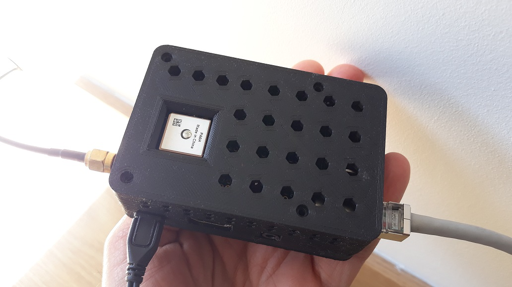
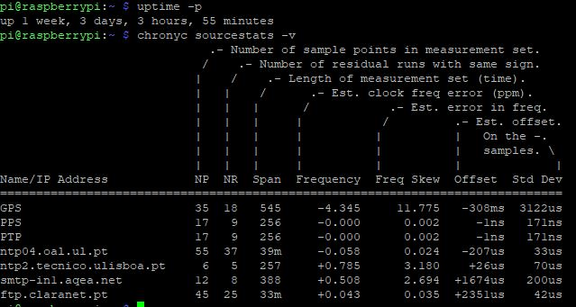

# Raspberry PI 3B+ NTP Server - Stratum 1
A straightforward approach to achieve a cost-effective (~100€) Stratum 1 NTP server, coordinated with highly precise PPS (Pulse Per Second) sourced from the GPS radio service plus NTP public servers across the internet to get the absolute time reference.

Can be prepared to be used with *off-the-grid* applications such as IoT in remote locations/air-gapped systems or WAN connected IoT ones (as presented here).

The end result with a Raspberry Pi 3B+ and an Adafruit Ultimate GPS HAT MTK3339:



This is my recipe for Raspberry PI OS `Bullseye`, kernel 5.10.103-v7+.

### Achievements @ April 2022:
- [X] ns local clock timekeeping (std dev < 200 ns on PPS source)
- [X] µs timekeeping across multiple networks (std dev < 100 µs)
- [X] stable operation with low frequency value (usually < 10 ppm)
- [X] serve time to more than 160 clients (capable of many more)
- [ ] correct the timekeeping skew from ambient temperature flutuation
- [ ] replace the fake RPI RTC with a DS3231 high precision one.



# List of materials and tools needed

**Mandatory**:
- Soldering iron to attach the pins to the Adafruit HAT
- SD Card with 8GB or more
- USB SD Card reader or other similar device to install Raspberry PI OS on the SD Card.
- Raspberry PI 3B+ with a suitable power adaptor
- Adafruit Ultimate GPS HAT
- RJ45 Ethernet CAT5 (or better) cable with proper lenght

**Optional** :
- 3D printed case for housing the fully assembled server. 
  > I suggest this [top](./stl/case_top_custom.stl) and this [bottom](https://www.thingiverse.com/thing:4200246) parts.
  > PLA or PETG are generally appropriate, depending on the ambient temperature and environment you'll apply this server in.
- 4x 2.5mm X 10mm bolts and nuts
- CR1220 battery for the MK3339
- Outdoor GPS active antenna with 28dB Gain, inline powered at 3-5V DC, with 5 meters of cable lenght and SMA male connector
- SMA female connector to IPEX (UFL) Adapter

# Setup the server

## Upgrade your system and install the required software
> sudo apt update && sudo apt upgrade -y
> 
> sudo apt install gpsd gpsd-tools gpsd-clients pps-tools chrony setserial -y


## Disable the serial TTY (linux console) on the UART interface
> sudo systemctl stop serial-getty@ttyAMA0.service
> 
> sudo systemctl disable serial-getty@ttyAMA0.service
> 
> sudo systemctl disable hciuart

## Disable the kernel support for the serial TTY
> sudo nano /boot/cmdline.txt

remove this ```console=serial0,115200``` sequence only and save.


## Configure the Raspberry PI

Add this to your '/boot/config.txt' file

```
# Uses the /dev/ttyAMA0 UART GPS instead of Bluetooth
dtoverlay=miniuart-bt

# Disables Bluetooth for better accuracy and lower interferance - optional
dtoverlay=disable-bt

# Disables Wifi for better accuracy and lower interferance - optional
dtoverlay=disable-wifi

# Configures the GPS with PPS gpio support
dtoverlay=pps-gpio,gpiopin=4

# Disables kernel power saving
nohz=off

# Disables Energy Efficient Ethernet - improves jitter and lag (~200us)
dtparam=eee=off

# Force CPU high speed clock
force_turbo=1
```

## Remove the support to receive NTP servers through DHCP
> sudo rm /etc/dhcp/dhclient-exit-hooks.d/ntp
> 
> sudo rm /lib/dhcpcd/dhcpcd-hooks/50-ntp.conf
> 
> sudo nano /etc/dhcp/dhclient.conf

Remove the references for `dhcp6.sntp-servers` and `ntp-servers`

## Decrease the serial latency for improved accuracy and stability
> sudo nano /etc/udev/rules.d/gps.rules

Add the content:

```
KERNEL=="ttyAMA0", RUN+="/bin/setserial /dev/ttyAMA0 low_latency"
```

## Force the CPU governor from boot, being always 'performance', aiming better timekeeping resolution
> sudo nano /etc/init.d/raspi-config

Replace all the content with:
```
#!/bin/sh
### BEGIN INIT INFO
# Provides:          raspi-config
# Required-Start: udev mountkernfs $remote_fs
# Required-Stop:
# Default-Start: S 2 3 4 5
# Default-Stop:
# Short-Description: Switch to ondemand cpu governor (unless shift key is pressed)
# Description:
### END INIT INFO

. /lib/lsb/init-functions

case "$1" in
  start)
    log_daemon_msg "Checking if shift key is held down"
    if [ -x /usr/sbin/thd ] && timeout 1 thd --dump /dev/input/event* | grep -q "LEFTSHIFT\|RIGHTSHIFT"; then
      printf " Yes. Not modifiing the scaling governor"
      log_end_msg 0
    else
      printf " No. Switching to performance scaling governor"
      SYS_CPUFREQ_GOVERNOR=/sys/devices/system/cpu/cpu0/cpufreq/scaling_governor
      if [ -e $SYS_CPUFREQ_GOVERNOR ]; then
        echo "performance" > $SYS_CPUFREQ_GOVERNOR
        echo 10 > /sys/devices/system/cpu/cpufreq/ondemand/up_threshold
        echo 100000 > /sys/devices/system/cpu/cpufreq/ondemand/sampling_rate
        echo 10 > /sys/devices/system/cpu/cpufreq/ondemand/sampling_down_factor
      fi
      log_end_msg 0
    fi
    ;;
  stop)
    ;;
  restart)
    ;;
  force-reload)
    ;;
  *)
    echo "Usage: $0 start" >&2
    exit 3
    ;;
esac

```

## Reboot to apply the system configurations
> sudo reboot

## Setup the GPSd daemon
> sudo nano /etc/default/gpsd

Replace all the content with:
```
START_DAEMON=”true”
USBAUTO=”false”
DEVICES=”/dev/ttyAMA0 /dev/pps0″
GPSD_OPTIONS=”-n”
```
Restart the GPSd service:

> sudo systemctl restart gpsd

## Setup chrony as the service for the NTP server
> sudo nano /etc/chrony/chrony.conf 

Replace all the content with:

```
# Welcome to the chrony configuration file. See chrony.conf(5) for more
# information about usable directives.

# Include configuration files found in /etc/chrony/conf.d.
confdir /etc/chrony/conf.d

# Use Debian vendor zone.
# pool 2.debian.pool.ntp.org iburst

# Use the Portuguese zone ** CHANGE THIS ** -- DISABLE THIS FOR ISOLATED SYSTEMS
pool 0.pt.pool.ntp.org iburst minpoll 5 maxpoll 5

# Use time sources from DHCP.
#sourcedir /run/chrony-dhcp

# Use NTP sources found in /etc/chrony/sources.d.
sourcedir /etc/chrony/sources.d

# This directive specify the location of the file containing ID/key pairs for
# NTP authentication.
keyfile /etc/chrony/chrony.keys

# This directive specify the file into which chronyd will store the rate
# information.
driftfile /var/lib/chrony/chrony.drift

# Save NTS keys and cookies.
ntsdumpdir /var/lib/chrony

# Set the NTS intermediate certificates
#ntsserverkey /etc/pki/tls/private/foo.example.net.key
#ntsservercert /etc/pki/tls/certs/foo.example.net.crt
#ntsratelimit interval 3 burst 1 leak 2


# Uncomment the following line to turn logging on.
#log tracking measurements statistics 
log tracking measurements statistics tempcomp

# Log files location.
logdir /var/log/chrony

# The lock_all directive will lock chronyd into RAM so that it will
# never be paged out. This mode is only supported on Linux. This
# directive uses the Linux mlockall() system call to prevent chronyd
# from ever being swapped out. This should result in lower and more
# consistent latency.
lock_all

# Stop bad estimates upsetting machine clock.
maxupdateskew 100.0

# enables response rate limiting for NTP packets - reduce the response rate for IP addresses sending packets on average more than once per 2 seconds, or sending packets in bursts of more than 16 packets, by up to 75% (with default leak of 2).
ratelimit interval 1 burst 16 leak 2

# specifies the maximum amount of memory that chronyd is allowed to allocate for logging of client accesses and the state that chronyd as an NTP server needs to support the interleaved mode for its clients. 
# 1GB
clientloglimit 10000000

# This directive enables kernel synchronisation (every 11 minutes) of the
# real-time clock. Note that it can’t be used along with the 'rtcfile' directive.
rtcsync

# Step the system clock instead of slewing it if the adjustment is larger than
# one second, but only in the first three clock updates.
makestep 1 3

# Get TAI-UTC offset and leap seconds from the system tz database.
# This directive must be commented out when using time sources serving
# leap-smeared time.
leapsectz right/UTC

# Defining the networks allowed to access the service
allow

# Expedited Forwarding DSCP directive traffic
dscp 48

# set larger delay to allow the NMEA source to overlap with
# the other sources and avoid the falseticker status
#refclock SOCK /tmp/chrony.ttyAMA0.sock refid GPS precision 1e-1 offset 0.9999
#refclock SOCK /tmp/chrony.pps0.sock refid PPS precision 1e-7


# set larger delay to allow the NMEA source to overlap with
# the other sources and avoid the falseticker status
refclock SHM 0 refid GPS precision 1e-1 offset 0.47 delay 0.2

# Adds also 4 ns signal propagation delay per each 304,8mm of cable lenght, from the external GPS antenna to the board - if applicable
refclock SHM 1 refid PPS precision 1e-7 prefer offset 65.62e-9

# Compares and saves the SoC temperature with the temperature correlation table bellow, every 30 seconds - future improvement
tempcomp /sys/class/thermal/thermal_zone0/temp 30 /etc/chrony/chrony.tempcomp
```

> sudo nano /etc/chrony/chrony.tempcomp 
#### Add the content:
```
20000 0
21000 0
25000 0
30000 0
40000 0
```

> sudo systemctl restart chronyd.service

## Check the sources for correct operation
> watch chronyc sources -v


# References
- http://www.gregledet.net/computers/building-a-stratum-1-ntp-server-with-a-raspberry-pi-4-and-adafruit-ultimate-gps-hat/
- https://wiki.polaire.nl/doku.php?id=dragino_lora_gps_hat_ntp
- http://www.philrandal.co.uk/blog/archives/2019/04/entry_213.html
- https://chrony.tuxfamily.org/doc/4.2/chrony.conf.html#tempcomp
- https://hallard.me/enable-serial-port-on-raspberry-pi/
- https://www.thingiverse.com/thing:2980860 *(top case part original design, not available ony more)*
- https://www.thingiverse.com/thing:4200246
